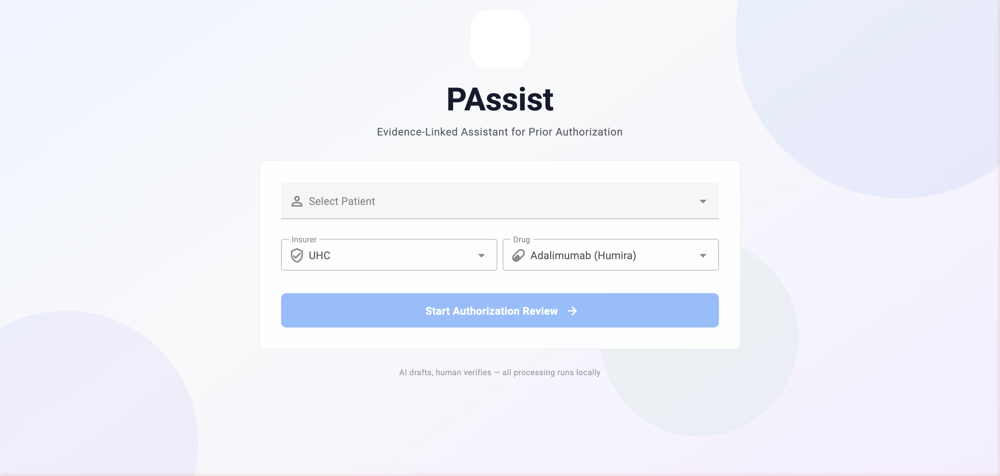

# PAssist &mdash; Evidence-Linked Assistant for Prior Authorization

**Physicians spend 14 hours/week on prior authorization paperwork. PAssist uses a local medical LLM to auto-extract clinical evidence, evaluate insurance policy criteria, and fill PA forms &mdash; so doctors can review in minutes instead of hours.**

<p align="center">
  
</p>

<p align="center">
  <em>AI drafts, human verifies &mdash; all processing runs 100% locally</em>
</p>

---

## The Problem

- **~35% of physicians** report prior authorization causes significant care delays
- Each PA form takes **30-45 minutes** of manual chart review and data entry
- Physicians spend an average of **14 hours/week** on PA-related paperwork
- Information is scattered across EHR records, clinical notes, and insurance policies

## What PAssist Does

1. **Extracts clinical evidence** from FHIR records and SOAP notes using MedGemma 4B (runs locally on Apple Silicon)
2. **Evaluates insurance policy criteria** through an interactive AND/OR decision tree with linked evidence
3. **Auto-fills ~75% of the PA form** &mdash; patient demographics from EHR, drug history and clinical findings from AI extraction
4. **Lets the doctor review every field** &mdash; accept, reject, or edit each AI suggestion with full source tracing back to clinical notes
5. **Generates a clinical justification letter** and downloadable PDF, ready to submit

## Key Screens

<table>
  <tr>
    <td align="center" width="50%">
      <br />
      <strong>Landing Page</strong><br />
      Select patient, insurer, and drug to begin
    </td>
    <td align="center" width="50%">
      <br />
      <strong>Full Workflow</strong><br />
      Review Queue + PA Form + Policy Tree + Clinical Notes
    </td>
  </tr>
</table>

**Review Queue** &mdash; Accept/reject/edit AI-extracted fields with source badges (EHR, AI, Inferred) | **Policy Tree** &mdash; AND/OR eligibility evaluation with evidence snippets and override controls | **Clinical Notes** &mdash; SOAP notes with evidence highlighting | **PA Form** &mdash; Live PDF preview that auto-regenerates on changes

## How It Works

```
 FHIR Records ──┐                                    ┌── Review Queue
 (demographics)  ├──→  FastAPI  ──→  MedGemma 4B  ──→├── Policy Tree (AND/OR)
 SOAP Notes ────┘     Backend       (local MLX)      ├── Auto-filled PDF
 (clinical text)         │                            └── Justification Letter
                         │
              Policy Decision Tree
              (extracted from UHC PDF)
```

**Pipeline:**
1. **FHIR fields** populate instantly (patient info, provider, diagnosis)
2. **MedGemma extraction** runs per-note via SSE, progressively filling drug history and step therapy fields
3. **Policy tree** evaluates AND/OR eligibility criteria with each extraction update
4. **Doctor reviews** each field and criterion, then downloads the completed PA form

## Key Features

- **100% local processing** &mdash; MedGemma 4B runs on Apple Silicon via MLX, no external API calls
- **No disease-specific hardcoding** &mdash; all clinical logic comes from the policy tree or LLM output
- **KV cache reuse** &mdash; static prompt prefix cached in GPU memory for ~50% inference speedup
- **Multi-stage evidence validation** &mdash; spam detection, n-gram grounding, keyword/anti-keyword filtering
- **OR-aware policy evaluation** &mdash; supports complex AND/OR gate logic with doctor override capability
- **Da Vinci PAS FHIR Bundle export** &mdash; standards-compliant interoperability output

## Tech Stack

| Layer | Technology |
|---|---|
| LLM | MedGemma 4B (mlx-lm on Apple Silicon) or Gemini 2.5 Flash |
| Backend | FastAPI + Uvicorn, SSE streaming |
| Frontend | Vue 3 + TypeScript + Vuetify 3 + Pinia |
| PDF | pypdf (AcroForm filling) |
| Data | Synthea FHIR bundles, SOAP notes |
| Policy Extraction | PyMuPDF + LangExtract + Gemini (offline, one-time) |

## Quick Start

### Prerequisites

- Python 3.11+ with [uv](https://docs.astral.sh/uv/)
- Node.js 18+
- Apple Silicon Mac (for local MedGemma) &mdash; or use `EXTRACTION_BACKEND=gemini`

### Demo Mode (no GPU required)

```bash
# Clone and install
git clone <repo-url> && cd medgemma-impact-tibotimz
cd frontend && npm install && cd ..

# Start backend with pre-computed results
SKIP_MODEL=1 uv run uvicorn server:app --port 8000

# Start frontend (in another terminal)
cd frontend && npm run dev
```

Open **http://localhost:5173**, select a patient, and explore the full workflow.

### Full Mode (Apple Silicon)

```bash
cp .env.example .env   # Add your HF_TOKEN
uv run uvicorn server:app --port 8000
cd frontend && npm run dev
```

## Architecture

See [CLAUDE.md](./CLAUDE.md) for comprehensive architecture documentation including SSE event flow, extraction pipeline, validation stages, and form filling logic.

## Team

- **Thibaud SOUTHIRATN**
- **Theotime LAVISSE**

---

<p align="center">
  Built for the Google MedGemma Hackathon 2025
</p>
